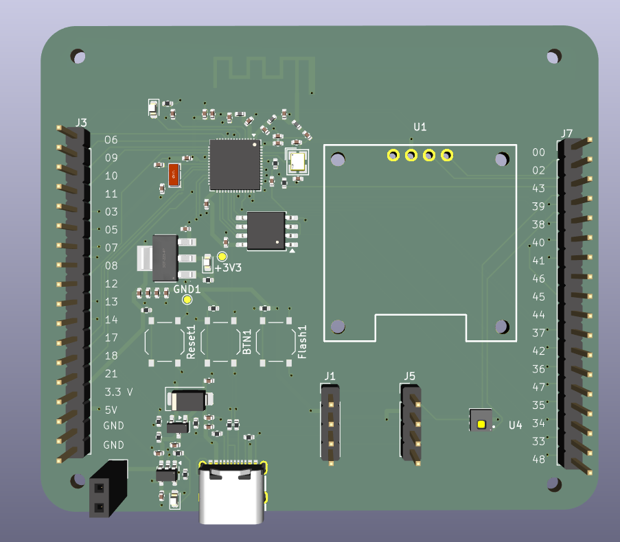
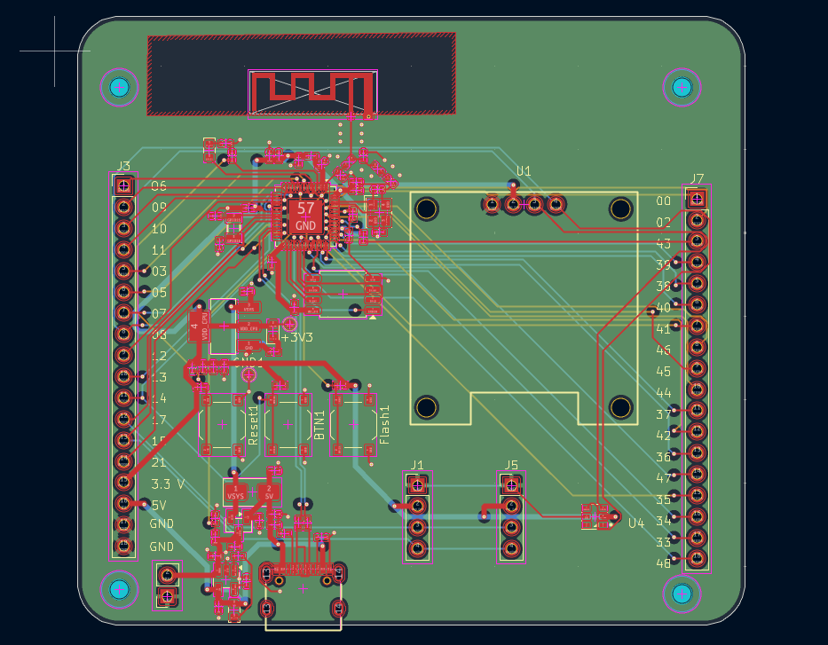
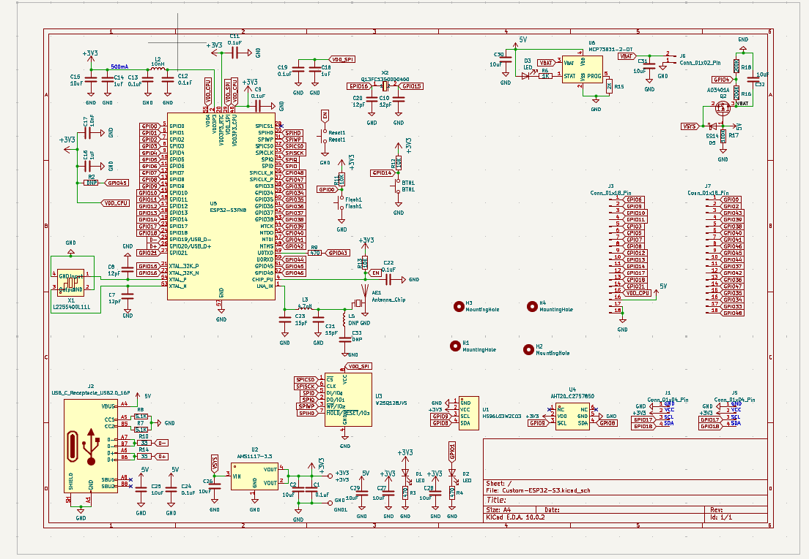
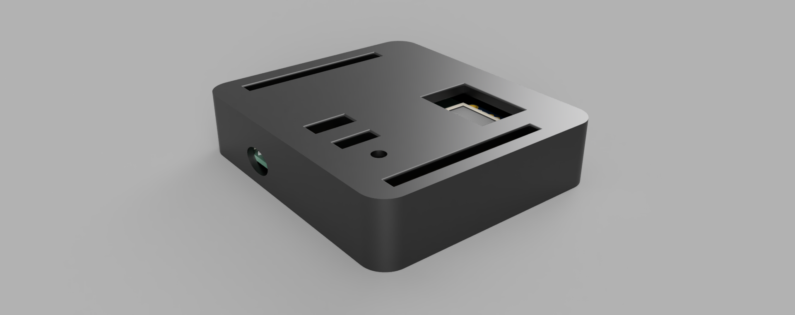

# Custom-ESP32-S3FN8-DevBoard
This is a custom ESP32-S3 board made on the ESP32-S3FN8 SOC with inbuilt I2C OLED display and AHT20 temperature and Humidity Sensor.

# 3D View of PCB

# PCB

# Schematic

# Render of PCB Case

